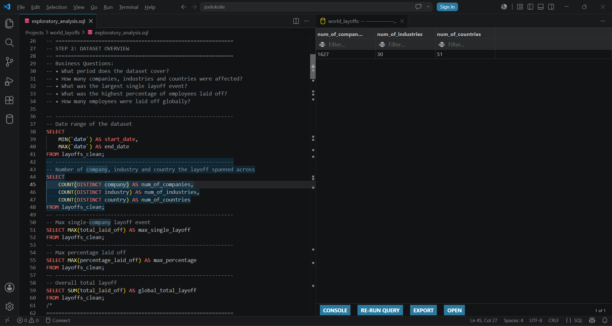
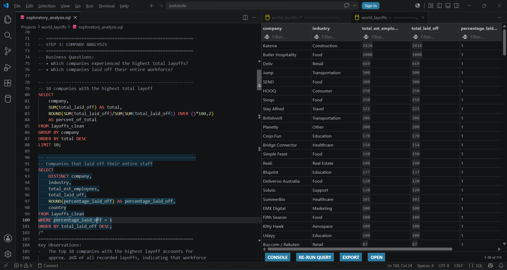
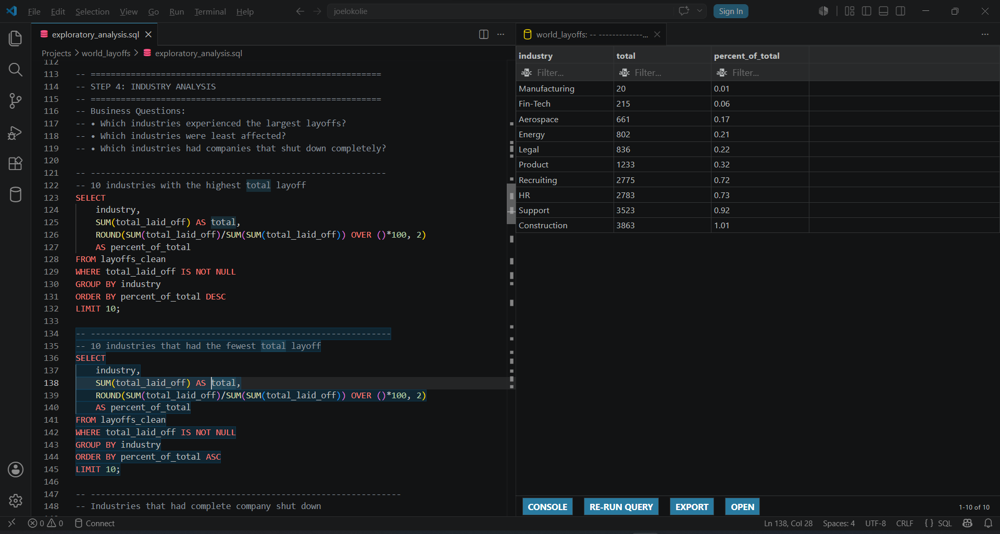
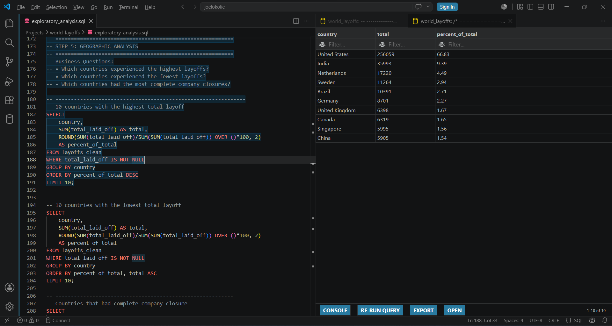
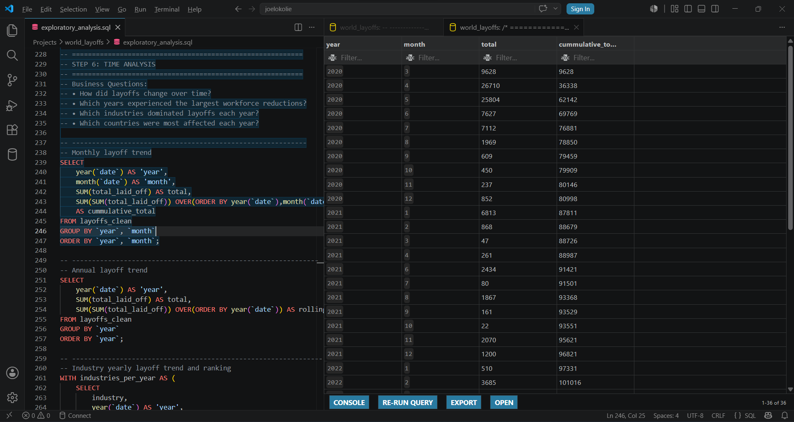
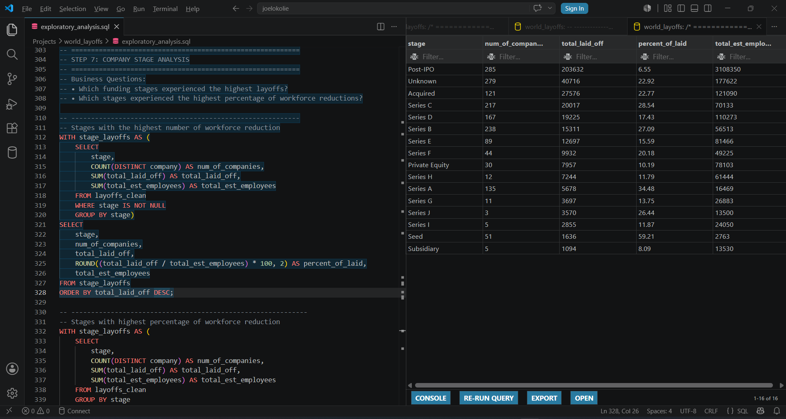
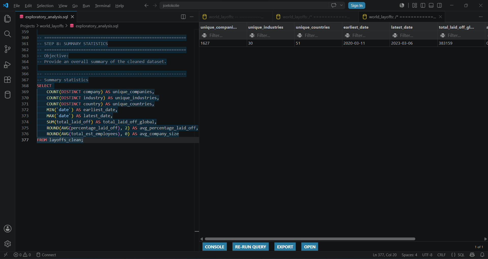

# Business Insights from the World Layoffs Dataset

## Project Overview

This project explores global layoff trends using SQL to uncover patterns across companies, industries, countries, time, and funding stages.

Using a cleaned version of the World Layoffs dataset, the analysis answers key business questions such as which companies experienced the largest workforce reductions, which industries were most affected, how layoffs changed over time, and how layoffs varied across company growth stages.

The project demonstrates how SQL can be used not only to query data but also to generate meaningful business insights that support data-driven decision making.

---

## Dataset

**Source:** Kaggle – World Layoffs Dataset

The dataset contains information on company layoffs, including:

- Company
- Industry
- Country
- Location
- Date
- Total Employees Laid Off
- Percentage of Workforce Laid Off
- Company Stage
- Funds Raised

**Note:** This analysis uses the cleaned dataset produced in my previous SQL Data Cleaning project.
**[World Layoff Data Cleaning](https://github.com/joelokolie/world-layoffs-data-cleaning)**

---

## Business Questions

This analysis answers the following questions:

### Dataset Overview

- What period does the dataset cover?
- How many companies, industries, and countries are represented?
- What was the largest single layoff event?
- How many employees were laid off globally?

### Company Analysis

- Which companies experienced the highest layoffs?
- Which companies laid off 100% of their workforce?

### Industry Analysis

- Which industries experienced the highest layoffs?
- Which industries were least affected?
- Which industries had the highest number of complete company closures?

### Geographic Analysis

- Which countries experienced the highest layoffs?
- Which countries experienced the fewest layoffs?
- Which countries recorded the most complete company shutdowns?

### Time Analysis

- How did layoffs change over time?
- Which years experienced the largest workforce reductions?
- Which industries dominated layoffs each year?
- Which countries were most affected each year?

### Company Stage Analysis

- Which funding stages experienced the highest layoffs?
- Which stages experienced the highest percentage of workforce reduction?

---

## Summary Statistics

---

## SQL Skills Demonstrated

- Data Aggregation
- GROUP BY
- Window Functions
- Common Table Expressions (CTEs)
- DENSE_RANK()
- Running Totals
- Date Functions
- Business Analysis
- Percentage Calculations

---

## Project File

| File | Description |
|------|-------------|
| `sql/exploratory_analysis.sql` | Complete SQL exploratory data analysis |

---

## Key Insights

Some of the insights discovered include:

- More than **383,000 employees** were laid off during the period covered.
- The dataset spans approximately **three years**.
- Layoffs were highly concentrated among a relatively small number of companies.
- The **United States** accounted for the majority of recorded layoffs.
- Retail, Consumer, and Food industries consistently ranked among the most affected sectors.
- Several companies laid off **100% of their workforce**, indicating complete business closures.
- Layoffs increased significantly during **2022**, with 2023 already accounting for a substantial share despite covering only part of the year.
- Companies in the **Post-IPO** stage recorded the largest number of layoffs.

---

## Tools Used

| Tool | Purpose |
|------|---------|
| SQL | Data analysis |
| MySQL Server | Database management |
| Visual Studio Code | SQL development |
| Git & GitHub | Project documenting and hosting |
| Kaggle | Dataset source |

---

## Future Improvements

- Build an interactive Power BI dashboard
- Perform statistical analysis using Python
- Create visualizations for trend analysis

---

## Project Environment

- Database: MySQL Server 8.0
- SQL Editor: Visual Studio Code
- Operating System: Windows 11

---

## Related Project

This analysis builds on my previous project:
**[World Layoffs Data Cleaning](https://github.com/joelokolie/world-layoffs-data-cleaning)**

where the raw dataset was cleaned and standardized for analysis.

---

## Author

**Joel Chukwudi Okolie**

Aspiring Data Analyst

GitHub: https://github.com/joelokolie

LinkedIn: https://www.linkedin.com/in/joel-okolie
